# Homelab: Windows-Domäne mit OPNsense-Firewall

Diese Testumgebung habe ich neben meiner Ausbildung zum IT-Systemtechniker
aufgebaut. Sie besteht aus vier virtuellen Maschinen unter Hyper-V auf meinem
eigenen Rechner: einer Firewall, einem Domänencontroller, einem Fileserver und
einem Windows-11-Client. Mit dem Lab wollte ich das Gelernte aus der Ausbildung
festigen und Praxiserfahrung sammeln.

Behandelte Themen:

- Active Directory: AD DS, eigene OU-Struktur, Gruppen nach AGDLP, delegierte
  Rechte für eine Helpdesk-Gruppe
- Gruppenrichtlinien, DNS und DHCP
- OPNsense: Regelwerk mit Aliasen, NAT und NTP als Zeitquelle für Kerberos
- NTFS- und Freigabeberechtigungen auf dem Fileserver
- Datensicherung mit Windows Server Backup, dem AD-Papierkorb, Veeam sowie der
  Konfigurationssicherung der Firewall, jeweils mit Restore-Test
- Fehlersuche an vier dokumentierten Störungsfällen

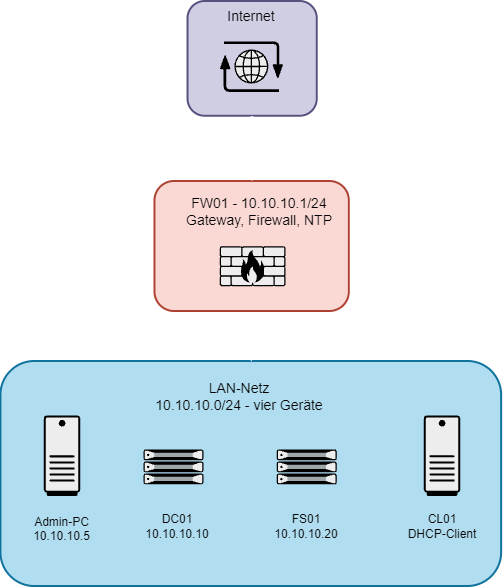

| Host | Betriebssystem | IP-Adresse | Rolle |
|---|---|---|---|
| FW01 | OPNsense | 10.10.10.1 | Gateway, Firewall, NTP |
| DC01 | Windows Server 2025 | 10.10.10.10 | Active Directory, DNS, DHCP |
| FS01 | Windows Server 2025 | 10.10.10.20 | Dateidienste |
| CL01 | Windows 11 Pro | per DHCP | Test-Client |

Die Domäne heißt `ad.mlab.internal`, das Netz ist `10.10.10.0/24`. Den
vollständigen IP-Plan, das Regelwerk und die Gruppenstruktur habe ich in
[technische-details.md](technische-details.md) dokumentiert.

## Vorbereitung

Zuerst habe ich Hyper-V eingerichtet und einen internen virtuellen Switch
(LAB-Intern) erstellt. Die Wahl fiel bewusst auf einen internen statt eines
privaten Switches, damit der Host-Rechner eine Netzwerkschnittstelle im Lab-Netz
erhält und der Zugriff auf die Weboberfläche der Firewall möglich ist. Auf
dieser Host-Schnittstelle habe ich manuell die 10.10.10.5 vergeben.

Anschließend wurden die vier VMs als Generation 2 angelegt. Für die
Windows-Maschinen habe ich Secure Boot sowie das virtuelle TPM (vTPM) aktiviert
(Voraussetzung für Windows 11). Bei OPNsense musste Secure Boot deaktiviert
werden, da das FreeBSD-basierte System sonst nicht startet.

Da mein Host-PC nur 16 GB RAM zur Verfügung hat, habe ich auf den
Windows-Maschinen dynamischen Arbeitsspeicher (Dynamic Memory) genutzt. Ihnen
wurde jeweils eine geringe Mindestmenge an RAM zugewiesen, sodass Hyper-V den
Speicher je nach tatsächlicher Auslastung dynamisch verteilt. Die genauen Werte
stehen in [technische-details.md](technische-details.md).

Die beiden Server habe ich bewusst in der englischen Version installiert.
Fehlermeldungen lassen sich damit genau so übernehmen, wie sie auf dem
Bildschirm stehen, und die Microsoft-Dokumentation sowie die meisten
Forenbeiträge beziehen sich ohnehin auf die englischen Bezeichnungen.
Der Client läuft dagegen auf Deutsch, so wie er auch an einem
Anwenderarbeitsplatz stehen würde.

Vor der weiteren Konfiguration habe ich auf allen vier Maschinen die
verfügbaren System- und Sicherheitsupdates eingespielt. Das schließt bekannte
Sicherheitslücken direkt zu Beginn und verhindert ungeplante Neustarts mitten
in der Einrichtung.

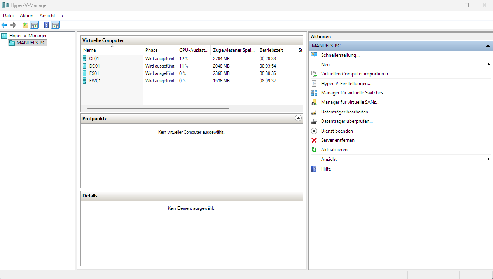

## Firewall

Ich habe mit der Firewall angefangen, weil alle anderen Maschinen über sie ins
Internet gehen. FW01 bekam zwei Netzwerkkarten: eine am Default-Switch von
Hyper-V für die WAN-Seite und eine am internen Switch LAB-Intern mit der
10.10.10.1.

Danach folgte die Grundkonfiguration. Ich habe ein eigenes Administratorkonto
statt root erstellt, die Firmware aktualisiert, die Zeitzone eingestellt und
1.1.1.1 sowie 9.9.9.9 als DNS-Server hinterlegt. Den Domänencontroller habe ich
hier bewusst nicht eingetragen, weil er als VM hinter der Firewall läuft. Wäre
diese VM ausgeschaltet, hätte die Firewall selbst keine Namensauflösung mehr,
und ich würde den Fehler an einer völlig falschen Stelle suchen.

### Regelwerk

Bevor ich die Regeln erstellt habe, habe ich Aliase angelegt, also benannte
Platzhalter für Adressen und Ports. Sollte sich das Netz später ändern, passe
ich nur den entsprechenden Alias an und muss nicht jede Regel einzeln
überarbeiten.

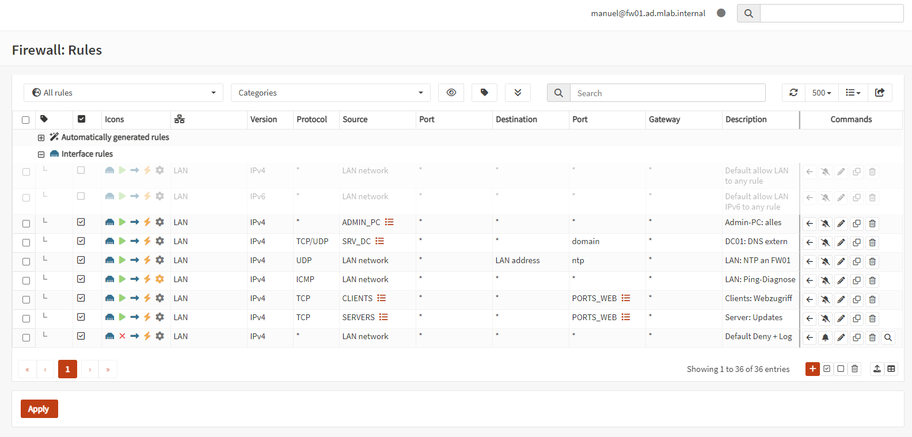

Insgesamt sind es sieben Regeln geworden. Mein Host-PC darf alles, damit ich
mich beim Konfigurieren nicht selbst aussperre. DNS-Anfragen nach außen darf
ausschließlich der Domänencontroller stellen, alle anderen Systeme müssen ihn
fragen. Clients und Server dürfen auf Port 80 und 443 ins Internet, das
allerdings über zwei getrennte Regeln. So kann ich den Clients später den
Internetzugriff entziehen, ohne den Servern die Updates und die Aktivierung zu
nehmen. Ganz unten steht eine Regel, die den gesamten übrigen Verkehr verwirft
und protokolliert.

Zusätzlich läuft auf der Firewall ein NTP-Dienst. Er ist auf DC01 als Zeitquelle
eingetragen, die Clients beziehen ihre Zeit über die Domänenhierarchie vom
Domänencontroller. Weicht die Uhr um mehr als fünf Minuten ab, verweigert
Kerberos die Anmeldung.

Ob die Regeln tatsächlich greifen, habe ich anschließend überprüft. Dafür habe
ich am Client (10.10.10.101) testweise 1.1.1.1 als DNS-Server eingetragen statt
des Domänencontrollers, woraufhin das Surfen sofort nicht mehr funktioniert hat.
Im Live-Log lässt sich nachvollziehen, welche Regel zugeschlagen hat.

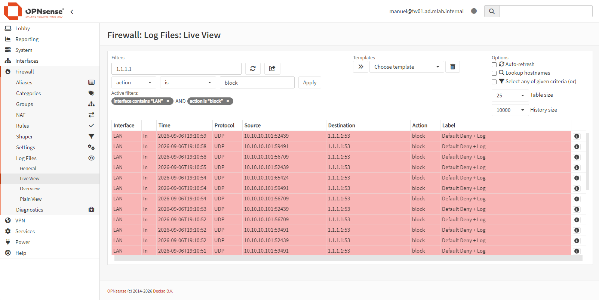

Beim ersten Anlauf hat dieser Test allerdings gar nichts geblockt, und der Grund
dafür lag nicht an meinen Regeln, sondern über ihnen: siehe
[Störungsbericht 2](stoerungsberichte/02-firewall-regelwerk-greift-nicht.md).

## Domänencontroller

Auf DC01 habe ich zuerst den Rechnernamen und die feste IP-Adresse gesetzt und
erst danach die Rollen installiert, weil sich beides auf einem Domänencontroller
nachträglich nur mit einigem Aufwand ändern lässt. Als DNS-Server verweist er
auf sich selbst, also auf 127.0.0.1.

Anschließend habe ich die Rolle Active Directory-Domänendienste installiert und
den Server zur neuen Gesamtstruktur `ad.mlab.internal` hochgestuft. Als
DNS-Weiterleitungen habe ich 1.1.1.1 und 9.9.9.9 eingetragen.

Zum Schluss habe ich auf DC01 noch die DHCP-Rolle installiert und einen Bereich
von .100 bis .199 eingerichtet. Danach muss der Server in Active Directory
autorisiert werden, sonst stellt er die Adressvergabe ein. Rund um diese
Autorisierung hatte ich später einen Fehler, der mir erst beim Abschlusscheck
mit `dcdiag` aufgefallen ist, siehe
[Störungsbericht 1](stoerungsberichte/01-dhcp-nicht-autorisiert.md).

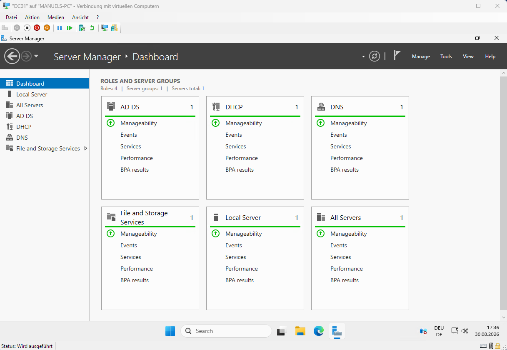

## Benutzer und Gruppen

Für die Benutzer und Rechner habe ich eine eigene OU-Struktur erstellt. Ganz
oben liegt die Haupt-OU MLAB, darunter habe ich die OUs Benutzer, Gruppen und
Computer angelegt, und unterhalb von Benutzer noch je eine eigene OU für IT,
Vertrieb und Buchhaltung.

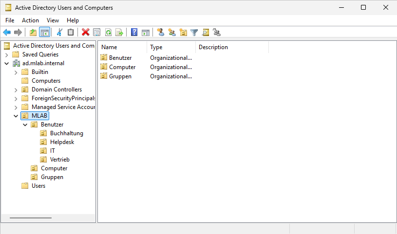

Die Standardcontainer Users und Computers sind keine OUs und lassen sich deshalb
nicht als Verknüpfungsziel für Gruppenrichtlinien verwenden. Objekte darin
bekommen nur die Richtlinien, die auf Domänen- oder Standortebene verknüpft
sind. Für eine gezielte Anwendung von Gruppenrichtlinien habe ich deshalb eigene
OUs angelegt.

Danach habe ich sieben Testbenutzer angelegt und die Gruppen nach dem
AGDLP-Prinzip aufgebaut. Die Benutzer kommen in globale Gruppen wie G-Vertrieb,
diese wiederum in domänenlokale Gruppen wie DL-Vertrieb-RW, und Rechte auf den
Ordner bekommen am Ende nur die domänenlokalen Gruppen.

Das verringert den Aufwand bei Änderungen erheblich. Wechselt jemand die
Abteilung oder soll ein anderer Fachbereich Zugriff bekommen, passe ich nur die
Gruppen an, die Berechtigungen auf dem Dateisystem bleiben völlig unberührt.

Ein gutes Beispiel dafür war die Buchhaltung, die den Vertriebsordner lesen
können sollte. Dafür habe ich G-Buchhaltung in DL-Vertrieb-RO aufgenommen und
am Ordner selbst nichts geändert. Lesen darf sie damit, ändern nicht, weil an
DL-Vertrieb-RO nur Lese- und Ausführungsrechte hängen.

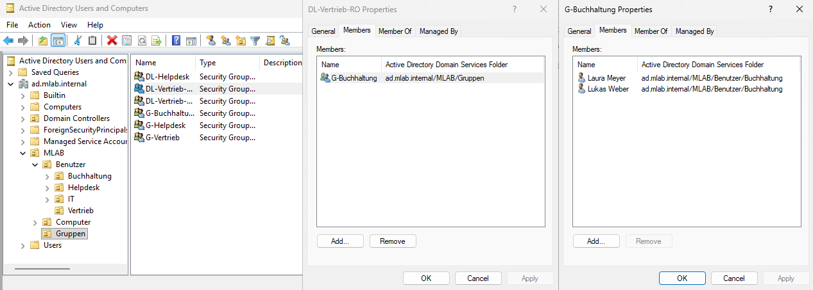

Für den Helpdesk habe ich die Rechte über den Assistenten *Delegate Control* auf
der OU Benutzer vergeben, beschränkt auf genau zwei Dinge: Kennwörter
zurücksetzen und Benutzerinformationen lesen. Getestet habe ich das später vom
Client aus. Das Zurücksetzen eines Kennworts funktioniert, das Löschen desselben
Benutzers wird verweigert.

## Gruppenrichtlinien

Insgesamt habe ich vier Richtlinien umgesetzt: eine Bildschirmsperre nach 15
Minuten, eine Laufwerkszuordnung für den Vertrieb, die Aktivierung der
Windows-Firewall in allen drei Profilen und eine Sperre für Wechseldatenträger.

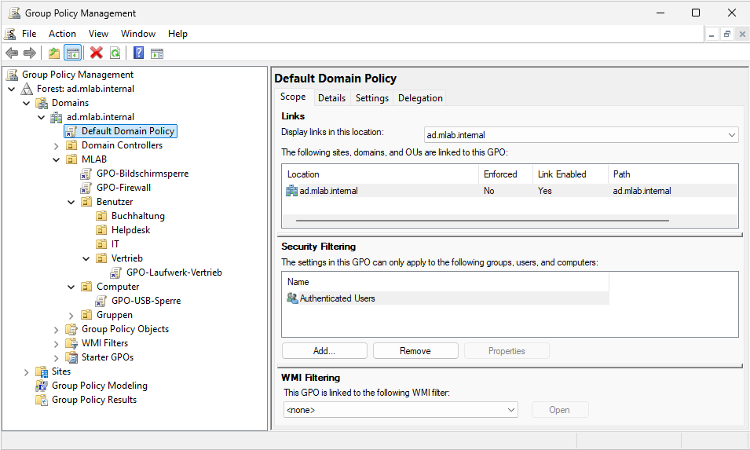

Die Kennwortrichtlinie habe ich bewusst in der Default Domain Policy gelassen
und nicht in eine eigene GPO ausgelagert, weil sie nur an der Domäne selbst für
Domänenkonten wirkt. Hängt man sie an eine OU, betrifft sie stattdessen nur die
lokalen Konten der dortigen Rechner.

Bei der Firewall-GPO habe ich alle drei Profile gesetzt, also Domäne, Privat und
Öffentlich. Welches davon greift, entscheidet Windows anhand des erkannten
Netzes. Ein Notebook ist im Büro im Domänenprofil und im Hotel-WLAN im
öffentlichen Profil, und gerade dort soll die Firewall nicht aus sein.

## Fileserver

FS01 habe ich eine zweite virtuelle Festplatte als Laufwerk D: gegeben, auf der
die Freigaben liegen. System und Daten getrennt zu halten hat mehrere Vorteile:
Eine Sicherung betrifft nur die Daten, und eine volllaufende Freigabe legt nicht
gleich das Betriebssystem lahm.

Die eigentliche Zugriffskontrolle erfolgt über die NTFS-Berechtigungen. Auf
Freigabeebene ist der Zugriff bewusst weniger restriktiv gehalten, damit die
Berechtigungslogik an einer einzigen Stelle liegt. Beide Ebenen werden ohnehin
kombiniert und die restriktivere gewinnt.

Eingetragen sind dort die authentifizierten Benutzer und nicht *Jeder*. Dadurch
ist der Zugriff auf erfolgreich angemeldete Konten beschränkt und das Gastkonto
bleibt außen vor.

Am Ordner selbst haben nur SYSTEM, die lokalen Administratoren und die beiden
domänenlokalen Gruppen Rechte, DL-Vertrieb-RW mit Ändern und DL-Vertrieb-RO mit
Lesen und Ausführen. Die Vererbung habe ich deaktiviert, damit von oben nichts
dazukommt, was ich nicht selbst gesetzt habe.

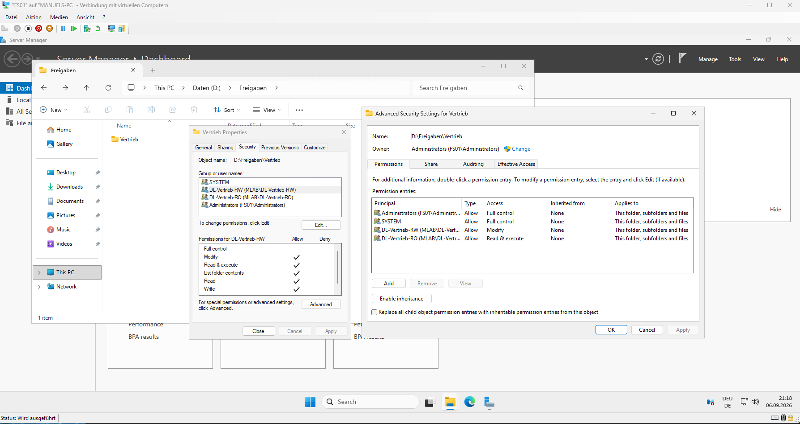

## Client

CL01 ist der Domäne beigetreten und hat die RSAT-Werkzeuge bekommen, damit ich
die Server vom Arbeitsplatz aus verwalten kann und nicht über die Serverkonsole
gehen muss. Installiert habe ich vier davon: die Active Directory Domain
Services- und Lightweight Directory Services-Tools für die Benutzer- und
Gruppenverwaltung, die Group Policy Management Tools für die
Gruppenrichtlinien, die DNS-Server-Tools für den DNS-Manager und die
DHCP-Server-Tools für die DHCP-Konsole.

Beim Domänenbeitritt bin ich in einen Stolperstein gelaufen. Ein neues
Computerkonto landet standardmäßig im Container Computers und nicht in meiner
OU-Struktur, weshalb die Computerrichtlinien zuerst nicht gegriffen haben. Ich
habe das Objekt nach `MLAB > Computer` verschoben und danach auf DC01 das
Standardziel für neue Computerkonten umgestellt:

```
redircmp "OU=Computer,OU=MLAB,DC=ad,DC=mlab,DC=internal"
```

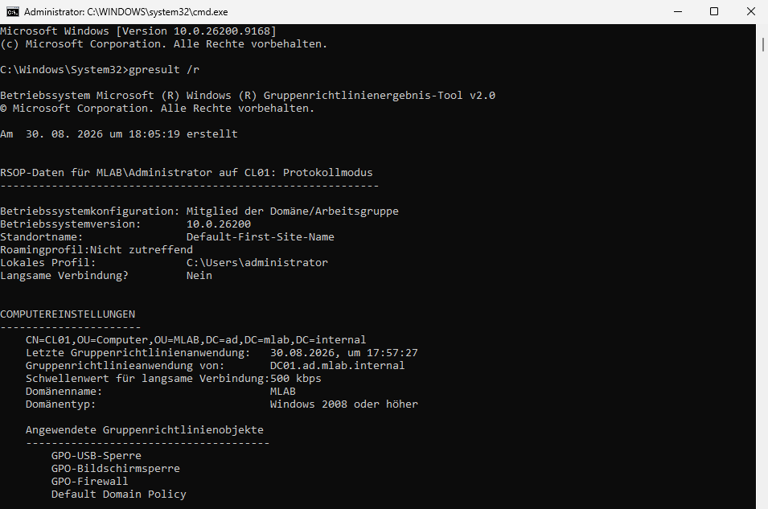

## Tests

Als alle vier Maschinen fertig eingerichtet waren, habe ich der Reihe nach
geprüft, ob auch wirklich alles funktioniert:

- Der Client bekommt Adresse, Gateway und DNS per DHCP.
- Die Anmeldung mit einem Domänenkonto funktioniert.
- `gpresult /r` zeigt in beiden Abschnitten die erwarteten Richtlinien.
- Laufwerk V: ist beim Vertriebsbenutzer verbunden, beim Buchhaltungsbenutzer
  nicht.
- Der Vertriebsbenutzer kann im Vertriebsordner speichern.
- Der Buchhaltungsbenutzer kann lesen, aber nicht speichern.
- Das Helpdesk-Konto darf Kennwörter zurücksetzen, aber keine Benutzer löschen.
- Die Zeitquelle am Client ist der Domänencontroller.

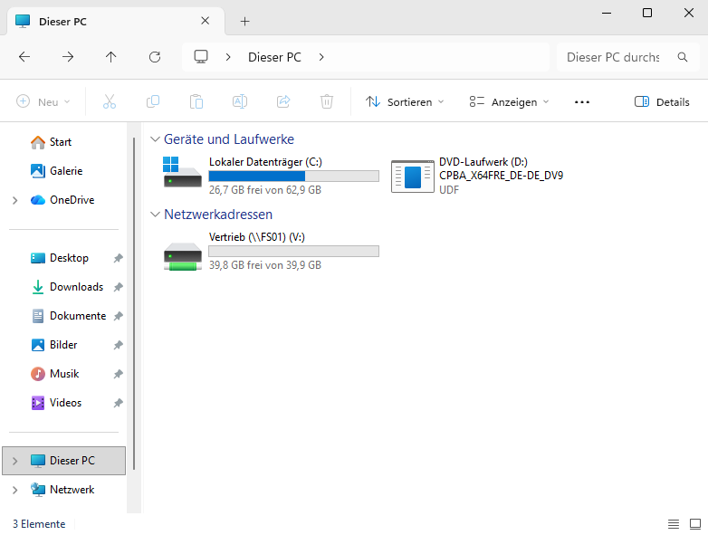
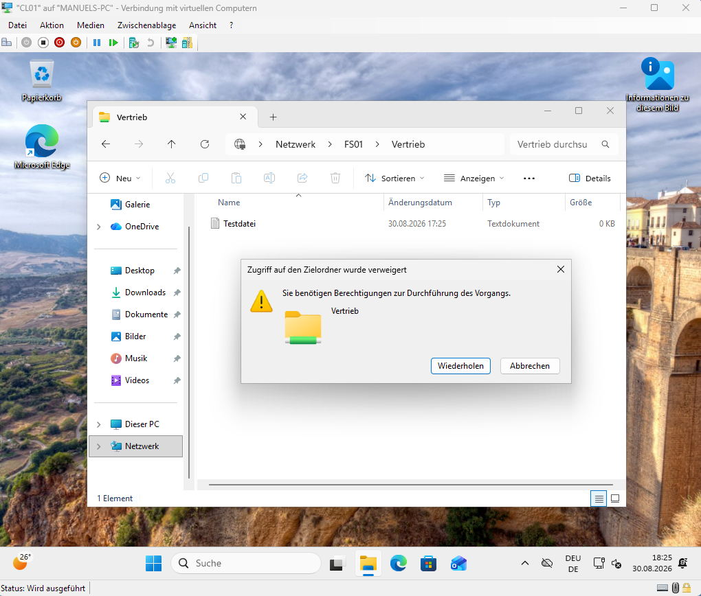

Dass die Buchhaltung kein Laufwerk V: bekommt, ist Absicht: Die
Laufwerkszuordnung hängt an der Vertriebs-OU. Lesen kann sie den Ordner trotzdem
über den UNC-Pfad `\\FS01\Vertrieb`, ändern aber nicht, wie der zweite
Screenshot zeigt.

Zum Abschluss habe ich die Domäne mit `dcdiag /c` durchgeprüft, also erst
nachdem alle Rollen standen und die Tests durch waren. Die vollständige Ausgabe
liegt als [dcdiag-01-09.txt](dcdiag-01-09.txt) im Repo.

Die für Active Directory relevanten Prüfungen, darunter DNS, Replikation, FSMO
und SysVol, waren erfolgreich. Bei einem einzelnen Domänencontroller prüft die
Replikation allerdings gegen keinen Partner, aussagekräftig wird dieser Test
erst mit einem zweiten DC.

Der Test `SystemLog` schlägt fehl. Er meldet Fehler und Warnungen aus dem
Systemprotokoll innerhalb eines begrenzten Zeitfensters, unabhängig davon ob sie
mit Active Directory zu tun haben. Darunter sind die DHCP-Meldungen aus
[Störungsbericht 1](stoerungsberichte/01-dhcp-nicht-autorisiert.md).

Die Prüfung habe ich später noch zweimal wiederholt. Im Lauf vom 08.09.
([dcdiag-08-09.txt](dcdiag-08-09.txt)) stand im Systemprotokoll die Meldung des
Zeitdienstes, aus der
[Störungsbericht 3](stoerungsberichte/03-dc-nimmt-zeit-nicht-an.md) geworden ist.
Im Lauf vom 09.09. ([dcdiag-09-09.txt](dcdiag-09-09.txt)), nachdem alle
Störungen behoben waren, ist auch `SystemLog` erfolgreich.

## Backup

Für vier verschiedene Ausfallszenarien habe ich vier Verfahren eingerichtet: den
AD-Papierkorb für ein einzelnes gelöschtes Objekt, Windows Server Backup für den
Systemzustand des Domänencontrollers, Veeam für die kompletten Server und die
Konfigurationssicherung von OPNsense für die Firewall.

Jedes der vier Verfahren habe ich auch tatsächlich zurückgespielt und dabei die
Zeiten gemessen. Zuletzt habe ich die Firewall aus der XML-Sicherung auf einer
neu installierten Maschine wiederhergestellt.

Der Aufbau, die eingesetzten Verfahren und die gemessenen Zeiten stehen in
[backup.md](backup.md).

## Offene Punkte

1. Monitoring auf einem eigenen Linux-System
2. Automatisierung wiederkehrender Aufgaben mit PowerShell
3. Netzsegmentierung mit VLANs und ein eigenes Netz für die Clients
4. Anbindung an Microsoft 365 und Entra ID

Dazu kommen kleinere Punkte am Regelwerk und an der Serverkonfiguration.

## Störungsberichte

Vier Fehler, die ich selbst eingegrenzt und behoben habe:

1. [DHCP zeigt einen roten Pfeil, obwohl der Server autorisiert ist](stoerungsberichte/01-dhcp-nicht-autorisiert.md)
2. [Das Regelwerk greift nicht, weil eine Default-Regel darüber steht](stoerungsberichte/02-firewall-regelwerk-greift-nicht.md)
3. [Der Domänencontroller nimmt die Zeit der Firewall nicht an](stoerungsberichte/03-dc-nimmt-zeit-nicht-an.md)
4. [Veeam bietet keine virtuellen Maschinen zum Sichern an](stoerungsberichte/04-veeam-findet-keine-vms.md)

---

Aufgebaut Ende August 2026, zuletzt ergänzt am 12. September 2026.
