# Backup

Nachdem die Domäne stand und die Tests durch waren, habe ich mich um die
Datensicherung gekümmert. Für vier verschiedene Ausfallszenarien habe ich vier
verschiedene Verfahren eingerichtet, weil jedes davon einen anderen Fall abdeckt
und keines die anderen ersetzt.

| Fall | Verfahren |
|---|---|
| Ein Benutzer wurde versehentlich gelöscht | AD-Papierkorb |
| Active Directory selbst ist beschädigt | Windows Server Backup, Systemzustand |
| Ein kompletter Server ist verloren | Veeam Backup & Replication |
| Die Firewall muss neu aufgesetzt werden | Konfigurationssicherung von OPNsense |

Die Veeam-Sicherungen laufen auf eine externe SSD von Western Digital mit 465 GB,
die am Host-PC hängt. Eine eigene physische Platte war mir wichtig: Liegt die Sicherung
dort, wo auch die virtuellen Maschinen liegen, schützt sie zwar vor
versehentlichem Löschen, nicht aber vor einem Plattenausfall.

## Windows Server Backup

Angefangen habe ich mit den Bordmitteln von Windows. Auf DC01 habe ich das
Feature installiert und eine Sicherung des Systemzustands eingerichtet. Der
Systemzustand ist kein vollständiges Abbild des Servers, sondern genau der Teil,
der Active Directory ausmacht: also die Verzeichnisdatenbank, SYSVOL, die
Registrierung und die Startdateien.

Vorher habe ich in einer eigenen OU Dienstkonten das Konto `svc-backup` angelegt
und in die Gruppe Sicherungsoperatoren aufgenommen. Sicherungssoftware muss
naturgemäß auf alle Daten zugreifen können, und dafür wollte ich nicht den
Administrator selbst verwenden. Für den Systemzustand reicht das, Veeam braucht
zusätzlich Administratorrechte auf dem Server, den es sichert. Solche Rechte
gelten immer nur für einen Rechner: Auf DC01 hat das Konto sie bereits über die
Domäne, auf FS01 musste ich es eigens in die Administratorengruppe des Servers
aufnehmen.

Ein eingeschränktes Konto ist das damit nicht, das ist mir bewusst. Wer die
AD-Datenbank sichern und zurückspielen darf, kommt ohnehin an alles heran. Der
Vorteil liegt darin, dass die Sicherung ein eigenes Konto hat und sich im
Nachhinein nachvollziehen lässt, welcher Zugriff von ihr kam und welcher von
einem Administrator.

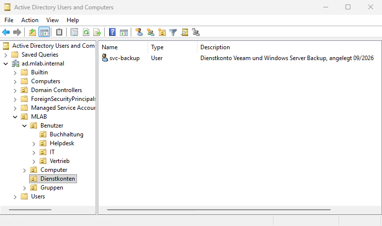

Diese Sicherung läuft bewusst nur manuell und nicht nach Zeitplan, weil die
tägliche Sicherung ohnehin über Veeam erfolgt und den Systemzustand mit abdeckt.

Anschließend habe ich den Ernstfall geprobt. Um 20:45 habe ich den Benutzer
Lukas Weber gelöscht, DC01 in den Verzeichnisdienst-Wiederherstellungsmodus
gestartet und den Systemzustand zurückgespielt. Um 21:15 war das Konto wieder
vorhanden, also eine halbe Stunde inklusive der Startprobleme, die weiter unten
beschrieben sind.

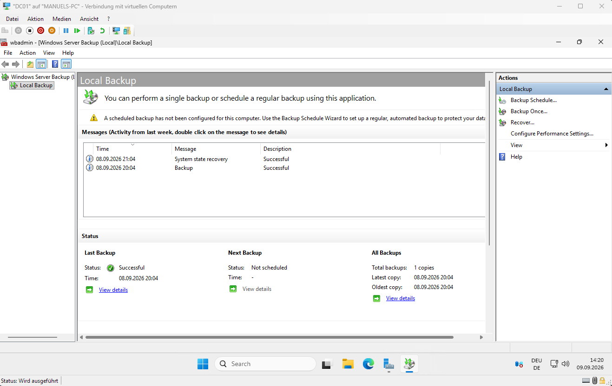

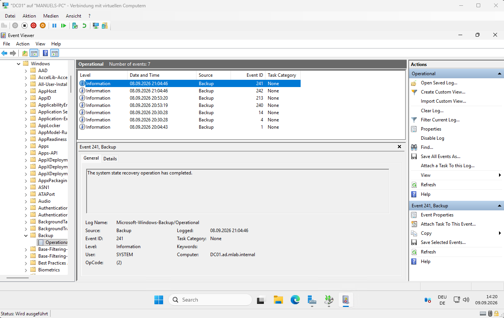

Dabei bin ich in einen Stolperstein gelaufen. Nach der Wiederherstellung startete
der Server bei jedem Neustart wieder im Wiederherstellungsmodus, weil in
`msconfig` unter *Boot* die Option *Safe boot* mit *Active Directory repair*
gesetzt geblieben war. Ich musste mich also jedes Mal mit dem DSRM-Kennwort
anmelden. Nachdem ich den Haken entfernt hatte, fuhr der Server wieder normal
hoch und die Anmeldung mit einem Domänenkonto hat sofort funktioniert.

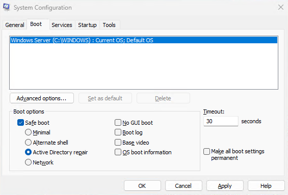

## AD-Papierkorb

Für ein einzelnes versehentlich gelöschtes Objekt ist der Weg über den
Wiederherstellungsmodus etwas übertrieben, weil der Domänencontroller dafür
mehrfach neu starten muss. Deshalb habe ich zusätzlich den Papierkorb aktiviert.
Er lässt sich danach nicht mehr abschalten und kostet etwas Platz in der
Datenbank, weil gelöschte Objekte vollständig aufbewahrt werden statt nur als
Rumpf.

Getestet habe ich ihn wieder mit Lukas Weber aus der Buchhaltung: löschen, im
Active Directory Administrative Center unter *Deleted Objects* heraussuchen,
*Restore*. Das dauert keine Minute, und der Server muss dabei nicht neu starten.

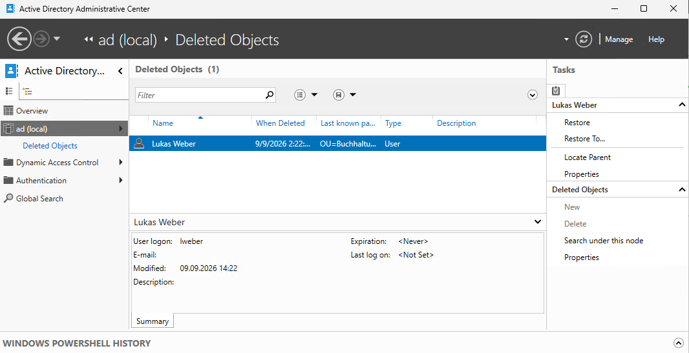

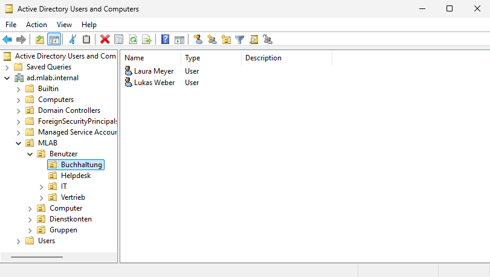

Damit habe ich für Active Directory zwei Wege: den Papierkorb für den Alltag,
also für einen Benutzer, eine Gruppe oder ein einzelnes Objekt, und die
Systemzustandssicherung für den Fall, dass am Verzeichnis selbst etwas
beschädigt ist.

## Veeam

Für die Server habe ich Veeam Backup & Replication 13 in der Community Edition
verwendet, Build 13.1.1.18. Diese Ausgabe ist kostenlos und deckt bis zu zehn
Rechner ab.

Ursprünglich wollte ich die virtuellen Maschinen von außen über den Hyper-V-Host
sichern, so wie es in Unternehmensumgebungen üblich ist. Das ist auf meinem
Aufbau nicht möglich, weil Hyper-V unter Windows 11 die dafür nötigen Funktionen
nicht mitbringt. Sie stehen nur unter Windows Server zur Verfügung. Aufgefallen
ist mir das erst, als die Liste der virtuellen Maschinen im Sicherungsauftrag
leer geblieben ist, siehe
[Störungsbericht 4](stoerungsberichte/04-veeam-findet-keine-vms.md).

Gesichert wird deshalb agentenbasiert. Auf DC01 und FS01 läuft jeweils ein
kleines Programm von Veeam, das den Server von innen heraus sichert und dabei die
Schattenkopie-Funktion des Gastbetriebssystems nutzt.

Als Erstes braucht Veeam einen Ablageort für die Sicherungen, dort Repository
genannt. Unter *Backup Infrastructure > Backup Repositories* habe ich eines vom
Typ *Direct attached storage* und der Unterart *Microsoft Windows* angelegt, weil
die Platte direkt am Host hängt. Als Pfad dient der Ordner `VeeamBackup` auf der
externen SSD.

Danach folgte eine Schutzgruppe namens *Lab-Server* mit DC01 und FS01. Sie
verteilt das Agentenprogramm selbstständig auf beide Server und hält es aktuell.
Für den Sicherungslauf meldet sich Veeam mit `svc-backup` an den Servern an, also
mit dem Dienstkonto und nicht mit dem Administrator.

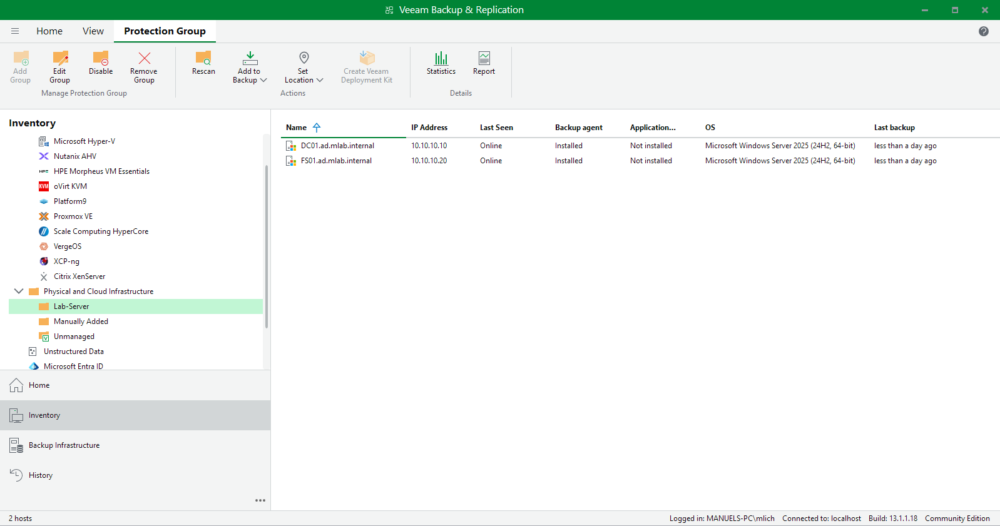

Der Auftrag heißt *Lab-Täglich* und läuft jeden Tag um 22 Uhr. Gesichert wird
jeweils der gesamte Rechner und nicht nur einzelne Laufwerke, aufbewahrt werden
sieben Wiederherstellungspunkte.

Mein RPO liegt damit bei 24 Stunden. Fällt FS01 an einem Donnerstagnachmittag
aus, ist der jüngste Stand der von Mittwochabend, und ein Arbeitstag ist weg. Die
sieben Punkte reichen außerdem nur eine Woche zurück: Wer erst nach zehn Tagen
bemerkt, dass in einer Datei etwas falsch ist, kommt an die ältere Fassung nicht
mehr heran. Nach dem Großvater-Vater-Sohn-Prinzip kämen dafür wöchentliche und
monatliche Stände dazu. Für ein Lab, in dem keine echten Daten liegen, habe ich
darauf verzichtet und es bei den sieben Punkten belassen.

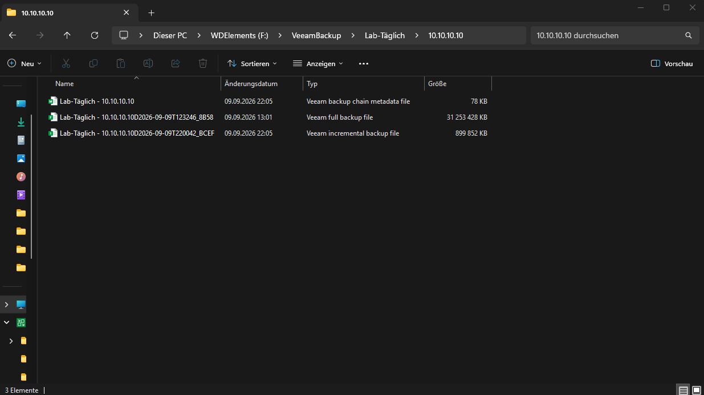

Im Repository liegt eine `.vbk` mit der Vollsicherung, dazu je Lauf eine `.vib`
mit den Änderungen und eine `.vbm` mit den Metadaten. Veeam sichert also
inkrementell: Auf eine einmalige Vollsicherung folgen nur noch die Unterschiede
zum jeweils letzten Lauf.

Den ersten Lauf habe ich direkt nach dem Anlegen von Hand gestartet, damit
überhaupt etwas zum Wiederherstellen vorhanden ist. Wie viel das Verfahren
ausmacht, zeigt sich an DC01: Die Vollsicherung umfasst 31 GB, der Lauf um 22 Uhr
am selben Abend nur noch 900 MB. Der Nachteil ist, dass die Dateien voneinander
abhängen. Geht die Vollsicherung verloren, sind auch die Inkremente wertlos.

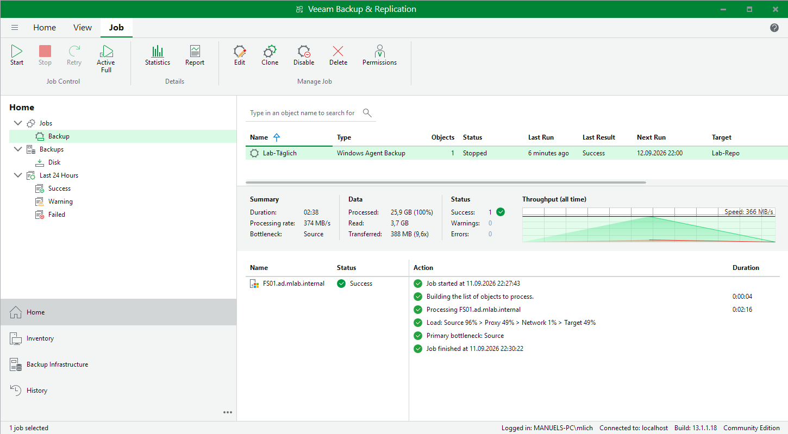

An der Statistik eines Laufs lässt sich das gut ablesen. Verarbeitet wurden
25,9 GB, gelesen davon 3,7 GB, und im Repository gelandet sind 388 MB. Der Lauf
hat 2 Minuten und 38 Sekunden gedauert.

Veeam zeigt außerdem an, welcher Teil der Kette den Lauf ausbremst. Bei mir steht
dort *Bottleneck: Source*, also das Lesen von der Platte des Servers. Das war zu
erwarten, weil sich auf meinem Rechner alle virtuellen Maschinen dieselbe
Hardware teilen.

## Der Wiederherstellungstest

In der Ausbildung haben wir es so gelernt: Ein Backup ist nur so viel wert wie
sein Restore. Ohne einen Wiederherstellungstest weiß man nicht, ob man im
Ernstfall etwas davon hat, und damit ist die Sicherung praktisch wertlos.

Deshalb habe ich FS01 im Hyper-V-Manager gelöscht, einschließlich der virtuellen
Festplatte.

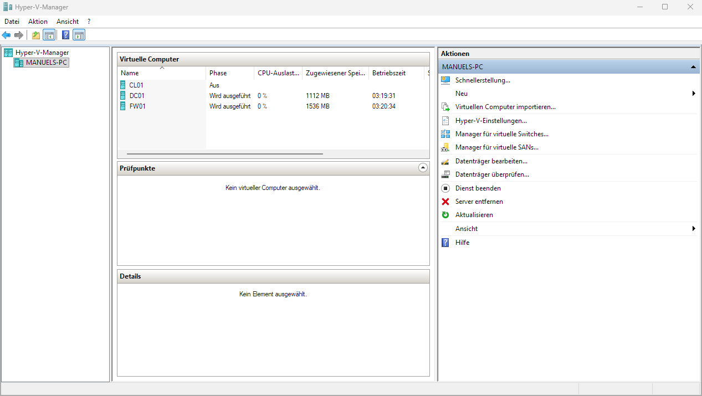

Anschließend habe ich in Veeam eine *Instant Recovery* gestartet. Dabei startet
Veeam die Maschine direkt aus dem Sicherungsarchiv, statt zuerst alle Daten
zurückzuschreiben. Der Server ist dadurch nach wenigen Minuten wieder erreichbar,
während im Hintergrund noch kopiert wird.

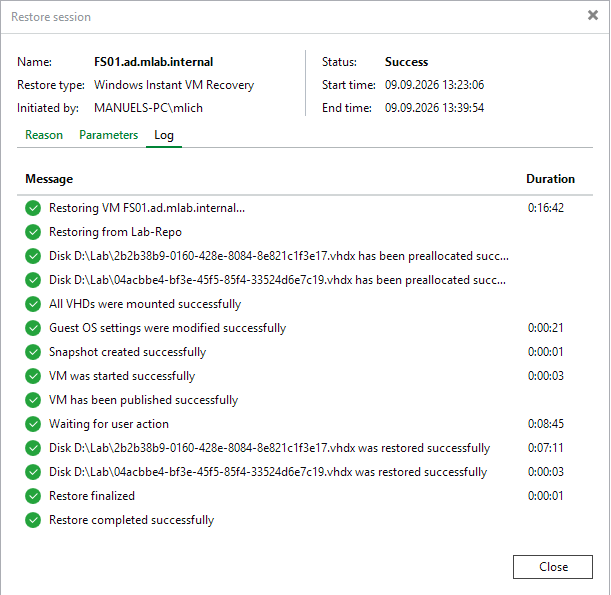

Der Vorgang lief von 13:23:06 bis 13:39:54, also 16 Minuten und 48 Sekunden.
Davon entfielen allerdings 8 Minuten und 45 Sekunden auf *Waiting for user
action*. Der Server lief zu diesem Zeitpunkt bereits, Veeam hat lediglich darauf
gewartet, dass ich die Wiederherstellung endgültig bestätige. An reiner
Arbeitszeit waren es rund acht Minuten. Als RTO, also als Zeit bis zur
Wiederverfügbarkeit, rechne ich trotzdem mit den vollen 17 Minuten, weil diese
Bestätigung im Ernstfall genauso dazugehört.

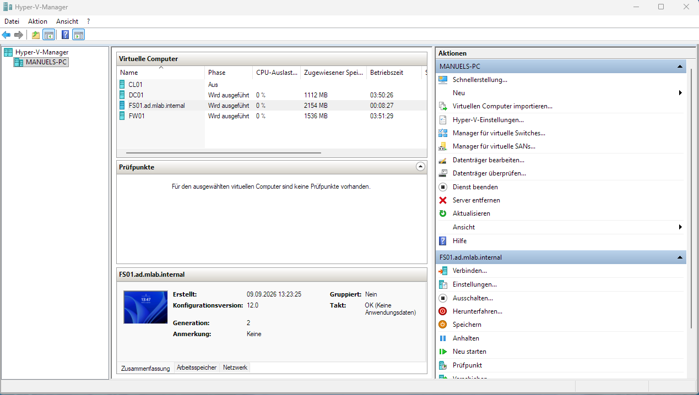

Danach habe ich geprüft, ob der Server nicht nur läuft, sondern auch die Aufgabe
erfüllt, für die er da ist. Die Anmeldung mit einem Domänenkonto funktioniert,
und die Freigabe Vertrieb ist ebenfalls wieder vorhanden.

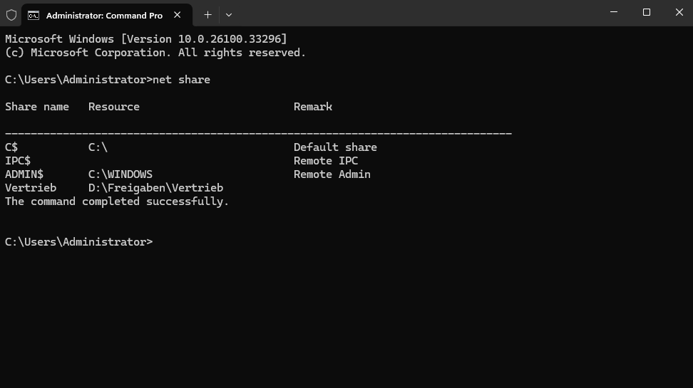

Die wiederhergestellte Maschine heißt im Hyper-V-Manager jetzt
`FS01.ad.mlab.internal` statt `FS01`, weil Veeam sie nach dem vollständigen
Rechnernamen benennt. Der Server selbst heißt weiterhin FS01, betroffen ist nur
der Anzeigename. Umbenennen hätte ich sie können, ich habe es aber bewusst
gelassen, damit erkennbar bleibt, welche Maschine aus einer Wiederherstellung
stammt.

## Firewall

Die Sicherung der OPNsense-Firewall ist vergleichsweise einfach. Unter
*System > Configuration > Backups* lässt sich die vollständige Konfiguration als
XML-Datei herunterladen.

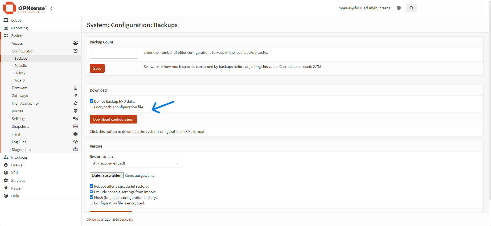

Auch das habe ich durchgespielt. FW01 habe ich dafür nur heruntergefahren und
nicht gelöscht, daneben eine zweite Maschine FW01-Restore angelegt und dort
OPNsense frisch vom ISO installiert. Nach der Installation steht im Regelwerk
nichts außer den beiden Standardregeln, und angemeldet ist man als root.

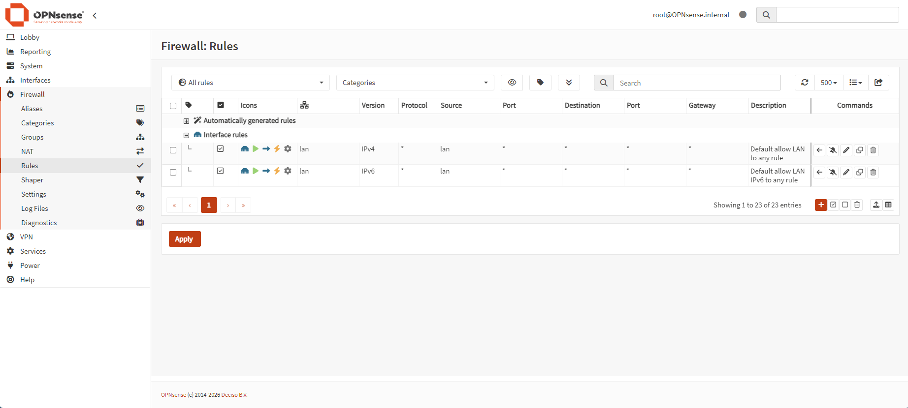

Danach habe ich die XML-Datei wieder eingespielt. Die Weboberfläche war
anschließend erst einmal nicht erreichbar, und auf der Konsole war zu sehen,
warum: LAN und WAN lagen auf den falschen Netzwerkkarten. Die Sicherung merkt
sich die Zuordnung nach Gerätenamen, also hn0 und hn1, und die neue Maschine hat
ihre beiden Karten in umgekehrter Reihenfolge bekommen.

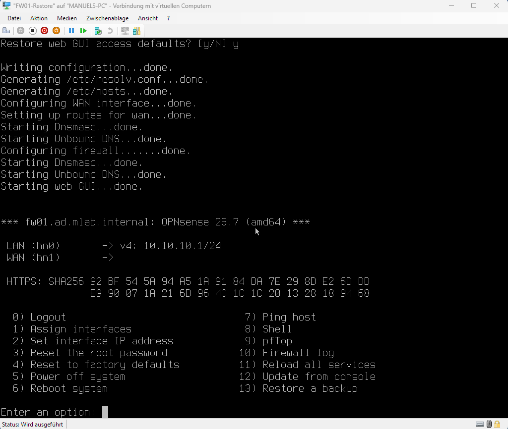

Über Option 1 habe ich die Zuordnung getauscht und über Option 2 auf der
LAN-Seite noch einmal die 10.10.10.1 gesetzt. Danach ging die Oberfläche wieder
auf, und zwar mit allen sieben Regeln, den Aliasen und dem Hostnamen
`fw01.ad.mlab.internal`. Auch mein eigenes Administratorkonto war wieder da,
angemeldet bin ich also nicht mehr als root.

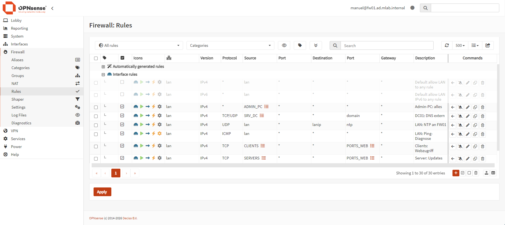

Insgesamt waren es rund 20 Minuten. Das Einspielen der XML-Datei selbst dauert
davon keine Minute, die Zeit geht fast vollständig für die neue virtuelle
Maschine und die Installation von OPNsense drauf. Das Zurückholen der Firewall
ist am Ende nur ein Upload und ein Neustart.

## Wie gut die Sicherung tatsächlich ist

Als Faustregel gilt ja in der Praxis **3-2-1-1-0**: drei Kopien der Daten, auf zwei
verschiedenen Medien, davon eine außer Haus und eine offline, und null Fehler
beim Wiederherstellungstest.

Daran gemessen ist mein Aufbau ehrlich gesagt unzureichend. Mir fehlt die dritte
Kopie ebenso wie die ausgelagerte, und die externe SSD hängt dauerhaft an genau
dem Rechner, auf dem auch alle virtuellen Maschinen laufen. Wirklich offline ist
sie damit ebenfalls nicht. In einer Unternehmensumgebung wäre das zu wenig. Für
eine Testumgebung auf dem eigenen Rechner ist es eine bewusste Entscheidung, weil
es mir um das Verständnis der Verfahren ging und nicht um produktive Daten.

Erfüllt ist immerhin die letzte Ziffer: Jedes der vier Verfahren habe ich auch
tatsächlich zurückgespielt und die Zeiten dabei gemessen.
