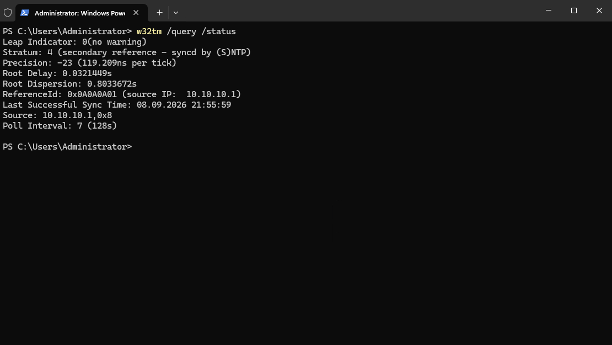

# Der Domänencontroller nimmt die Zeit der Firewall nicht an

**06.09. – 08.09.2026**

## Symptom

Aufgefallen ist mir das bei der Kontrolle mit `dcdiag /c` auf DC01
([dcdiag-08-09.txt](../dcdiag-08-09.txt)). Im Systemprotokoll standen mehrere
Meldungen des Zeitdienstes, und beim Nachsehen hat sich gezeigt, dass die
Zeitquelle nicht stimmt.

In meinem Lab gibt die Firewall die Zeit vor, der Domänencontroller holt sie von
dort und die Clients wiederum vom Domänencontroller. Auf DC01 kam das aber nicht
an:

```
w32tm /resync        -> The computer did not resync because no time data was available.
w32tm /query /source -> Local CMOS Clock
```

`Local CMOS Clock` bedeutet, dass DC01 seine eigene Hardwareuhr verwendet und die
Firewall ignoriert. Ein unmittelbares Problem war das nicht, die Abweichung lag
bei drei Sekunden und Kerberos toleriert fünf Minuten. Ein Domänencontroller, der
die Zeit für die gesamte Domäne vorgibt und sie selbst aus dem BIOS bezieht, ist
allerdings nicht das, was ich haben wollte.

## Suche

Zuerst habe ich auf DC01 gesucht. Die Konfiguration war korrekt, die Firewall war
als Zeitquelle eingetragen, und in der Firewall-Regel war der Weg dorthin
freigegeben. Trotzdem kam bei jedem Versuch dieselbe Meldung.

Erst danach habe ich auf der Firewall selbst nachgesehen. Der Zeitdienst lief,
und in der Liste standen auch alle vier Zeitserver aus dem Internet eingetragen.
Verwendet wurde jedoch keiner davon.

## Ursache

Ein Zeitserver liefert nicht nur eine Uhrzeit, sondern gibt in jeder Antwort auch
an, wie verlässlich seine eigene Uhr gerade ist. Die Firewall hatte sich mit den
Zeitservern im Internet noch nicht abgeglichen und hat deshalb mitgeteilt, dass
ihre Zeit nicht verwendbar ist. Windows nimmt eine solche Antwort nicht an und
meldet, es habe keine Zeitdaten erhalten, obwohl Pakete ankommen.

Dass der Abgleich nicht zustande kam, lag an einer Einstellung. Ohne die Option
Iburst fragt der Dienst nur alle 64 Sekunden einmal nach und benötigt dadurch
etwa zehn Minuten, bis er sich für einen Zeitserver entscheidet. Ich habe den
Dienst beim Suchen aber mehrfach neu gestartet, und jeder Neustart beginnt diesen
Vorgang von vorne. So kam er nie weit genug.

## Behoben

Auf der Firewall habe ich unter *Services > Network Time* bei allen vier
Zeitservern die Option Iburst aktiviert. Damit fragt der Dienst beim Start
mehrere Pakete kurz hintereinander ab und ist in weniger als einer Minute soweit.

Kurz darauf war auf der Statusseite zu sehen, dass die Firewall einen der
Zeitserver tatsächlich verwendet. Er wird dort als *Active Peer* geführt, im
Unterschied zu den übrigen, die nur als Kandidaten gelistet sind. Auf DC01 hat es
anschließend sofort funktioniert:

```
w32tm /resync
The command completed successfully.
```



Als Quelle steht nun 10.10.10.1 statt der eigenen Uhr. Das Stratum gibt an, wie
weit eine Maschine von der ursprünglichen Referenzuhr entfernt ist. Die
Zeitserver im Internet liegen auf Stratum 2, die Firewall wird damit zu Stratum 3
und DC01 zu Stratum 4.

## Merken

Einen Dienst neu zu starten ist in der Regel ein sinnvoller erster Schritt. In
diesem Fall war es der falsche, weil der Abgleich mit den Zeitservern danach
jedes Mal wieder bei null begonnen hat. Manche Dienste brauchen einige Minuten,
bevor sich überhaupt beurteilen lässt, ob eine Änderung gewirkt hat.

Dazu kommt, dass die Meldung zwar auf DC01 erschienen ist, die Ursache aber eine
Station davor lag. Bei einer Kette aus Internet, Firewall, Domänencontroller und
Client prüfe ich künftig zuerst, ob die Quelle überhaupt etwas Brauchbares
liefern kann, bevor ich beim Empfänger suche.
